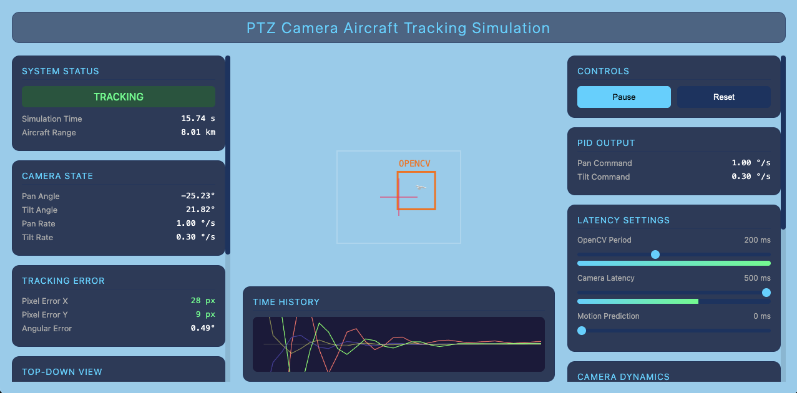

# PTZ Aircraft Tracker Simulation

A realistic 3D simulation of a PTZ (Pan-Tilt-Zoom) camera tracking an aircraft, featuring VISCA rate quantization, latency simulation, and PID control.



## Features

- **3D Visualization**: Built with Three.js for a realistic representation of the tracking scenario.
- **Camera Simulation**:
  - Configurable **OpenCV Period** (detection latency).
  - Configurable **Camera Latency** (command processing delay).
  - **Rate Quantization**: Supports both linear and VISCA table-based rate quantization.
  - **Dynamics**: Adjustable maximum pan/tilt acceleration.
- **Sensors**: ADS-B reports every 5 s and OpenCV detections every OpenCV Period, each with adjustable noise. Arrivals are marked in the camera view, top-down view, and time history.
- **Clouds**: Adjustable clouds placed between the camera and the aircraft block OpenCV, to test tracking through a loss of visual.
- **Estimation**: An extended Kalman filter fuses ADS-B and OpenCV (with OpenCV's latency accounted for), and can be compared against a simple two-point estimator.
- **Control System**: Tunable PID controller for tracking performance.

## Deployment

To deploy the application to the production server (`heavymeta.org`), use the following `rsync` command:

```bash
rsync -avz --exclude '.git' --exclude '*.bak' ./ heavymeta.org:/var/www/lab.heavymeta.org/html/ptzsim/
```

This command syncs the current directory to the remote server, excluding git files and backup files.
